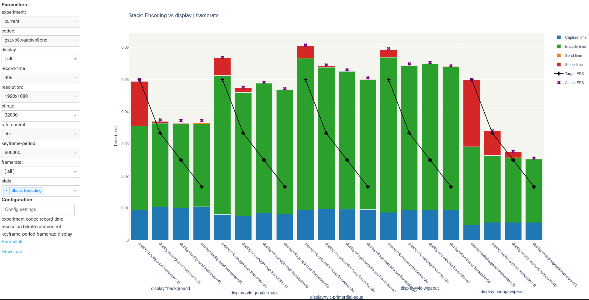
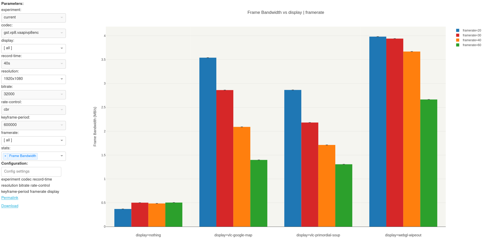
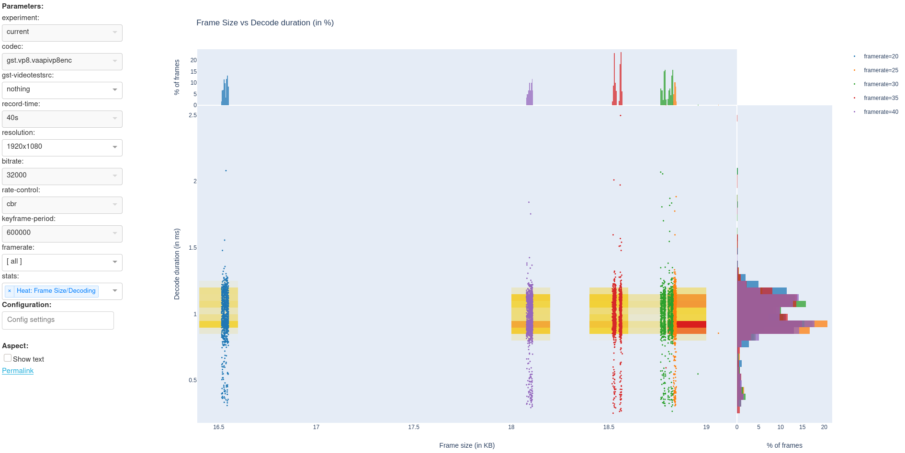
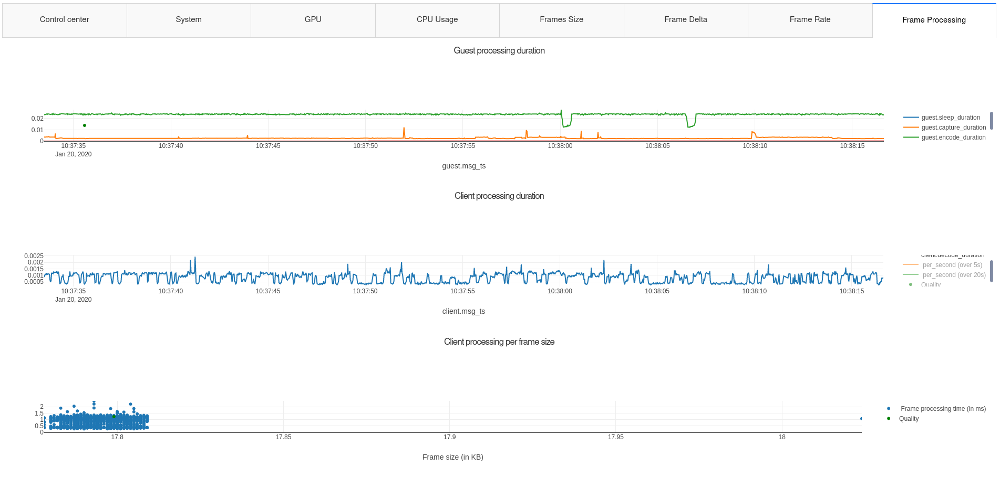

Spice Streaming Stats Collection and Visualization
==================================================

***EXPERIMENTAL REPOSITORY***

This repository contains the Python environment for benchmarking Spice
video streaming. Everything it contains should be considered *not*
stable and everything may change from one commit to another.

The goal of the code in this project is to:

1. run exhaustive benchmarks of SPICE video streaming in a deterministic and
**reproductible** way
  - with different video encoding parameters (eg,
bitrate, keyframe period, framerate, etc)
  - and environment settings
(eg, resolution, screen activity, etc).
  - The setting of these parameters is fully scripted and automated,
and the recording of the performance indicators as well.
  - the tool benchmarks all the possible combination of settings to
    have a complete overview of the situation (*matrix benchmarking*)
2. record several performance indicators to understand the behavior of
the different systems (the guest doing the video encoding, the
host/server forwarding the data and the client displaying the video
stream).
  - record system CPU and memory load, the CPU usage of the local
    spice process (streaming-agent, Qemu/spice-server, spice client)
  - record spice-internal performance indicators such a the frame
    capture/encode/send times, the frame sizes, etc.
3. visualize the raw values of the performance indicators for a given
record (*record viewer*)
4. visualize a large number of experiment records with the help of
aggregated statistics, to have an overall view of the influence of the
different parameters (*matrix visualized*).

The code of the *matrix visualized* (and the *record viewer*) is very
experimental and evolves according to our current investigations.

Installation
------------

### For all modes


```
pip install --user pyyaml
```

### Agent mode

```
dnf install sysstats
dnf install intel_gpu_tools
```

### Viewer and collector modes

```
pip install --user dash numpy scipy
```

Configure and execute
---------------------

    ./local_agent.py <mode>

See the bottom of [cfg/adaptive/agents.yaml](cfg/adaptive/agents.yaml)
for the execution modes. Currently, the main modes are:

    guest_agent, server_agent, client_agent
    viewer
    collector, benchmark

Try it
------

To try the viewer mode (matrix visualization + record viewer):

    git clone https://gitlab.com/kpouget_spice/streaming_stats.git -b v2019.01.22 --depth 1
    cd streaming_stats

    tar xvf docs/samples/study_FPS.tgz # will populate results/study_FPS/
    cp ./docs/samples/report_framerate_decode.dill ./saved/

    pip install --user dash pyyaml numpy scipy
    ./local_agent.py viewer
    # OR pipenv run ./local_agent.py viewer

    xdg-open http://127.0.0.1:8050/matrix/

then select a property to see with the **stats** drop-down list, and
change the *framerate* and *display* values to narrow down the
experiments shown onscreen.

See for instance:

* the frame bandwidth (MB/s) for the different experiments, in 2K resolution
  * http://127.0.0.1:8050/matrix/?resolution=1920x1080&framerate=20&stats=Frame%20Bandwidth%20(per%20sec)
* the linear regression of the Client CPU usage against the framerate (unselect video playback `vlc_*` in the legend)
  * http://127.0.0.1:8050/matrix/?resolution=1920x1080&stats=Reg:%20Client%20CPU%20vs%20Framerate
* the heatmap of the framesize against decoding duration, for each of the frames
  * http://127.0.0.1:8050/matrix/?resolution=1920x1080&framerate=20&stats=Heat:%20Frame%20Size/Decoding
* a report of the decoding time against the framerate
  * http://127.0.0.1:8050/matrix/?resolution=1920x1080&stats=Report:%20Decoding%20vs%20Framerate
* saved/standalone version of the report, without dependency to the rest of the framework
  * http://127.0.0.1:8050/saved/report_framerate_decode.dill
* the display of the raw values for of a particular experiment
  * http://127.0.0.1:8050/viewer/results/study_FPS/nothing/1920x1080/bitrate=32000_rate-control=cbr_keyframe-period=600000_framerate=20.rec


Screenshots
-----------

### Matrix visualizer (aggregated data)








### Viewer mode (raw data)



Known Issues
------------

* Doesn't work (yet) with Python3.8, and not with Python < 3.7.
